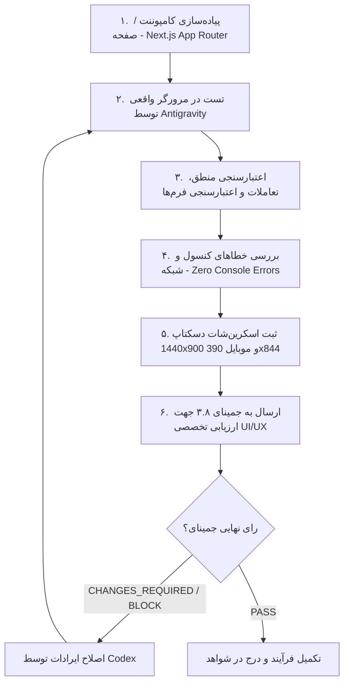

# Phase 2 Frontend Architecture & Quality Blueprint (P2-W4)

**Package**: `PHASE2-CORE-PRODUCT-BUILD`  
**Track**: `P2-W4 — FRONTEND EXPERIENCE SYSTEM`  
**Reviewer**: GEMINI 3.8 PRIMARY REVIEWER  
**Policy**: Standing Employer Order (Definition of Done)

---

## ۱. چرخه اجباری تضمین کیفیت فرانت‌اند (Mandatory QA Lifecycle)

برای هر کامپوننت، صفحه یا قابلیت جدید فرانت‌اند، این چرخه تا صدور تاییدیه نهایی جمینای اجباری است:

---

## ۲. ماتریس حالت‌های اجباری فرانت‌اند (Mandatory States Matrix)

هر صفحه قبل از ارائه به جمینای باید در این ۸ حالت استاندارد مورد تست و تایید قرار گیرد:

1. **NORMAL**: حالت ایده‌آل و بارگذاری‌شده با داده‌های نمایشی.
2. **LOADING**: اسکلت بارگذاری (Skeleton UI) یا شاخص‌های پیشرفت متناسب.
3. **EMPTY**: وضعیت بدون داده (مانند عدم وجود دوره یا تکالیف ثبت‌شده) به‌صورت View ایستا بدون دکمه‌های تکراری نامعتبر.
4. **ERROR**: مدیریت خطاهای سمت سرور و رندر مرز خطا (Error Boundary).
5. **FORBIDDEN (401/403)**: هدایت امن به صفحه لاگین یا نمایش دسترسی غیرمجاز.
6. **MOBILE (390x844)**: چیدمان تک‌ستونه عمودی، فواصل تاچ مناسب (حداقل 44x44px)، بدون اسکرول افقی.
7. **DESKTOP (1440x900)**: تقارن گرید، فضاهای تنفس، هدر و سایدبار یکپارچه.
8. **RTL**: تراز کامل راست‌به‌چپ تمامی متون، جهت‌گیری صحیح آیکون‌های ناوبری، و فونت‌های استاندارد فارسی.

---

## ۳. معماری صفحات و روت‌های فاز ۲ (Route Planning)

| مسیر (Route) | هدف و عنوان | مخاطب | وضعیت فاز |
|---|---|---|---|
| `/` | صفحه اصلی و ویترین دوره‌ها | همه کاربران | پیاده‌سازی‌شده در فاز ۱ |
| `/login` | فرم ورود کُدشو با رمز عددی | دانش‌آموز / والدین | پیاده‌سازی‌شده در فاز ۱ |
| `/dashboard/student` | داشبورد متمرکز دانش‌آموز (دوره‌های فعال، پروژه‌ها) | دانش‌آموز | آماده پیاده‌سازی (P2-W3) |
| `/dashboard/student/courses/[id]` | مشاهده درس تعاملی و ثبت پاسخ پروژه | دانش‌آموز | آماده پیاده‌سازی (P2-W3) |
| `/dashboard/parent` | داشبورد خلاصه پیشرفت فرزند (سنتتیک) | والد | آماده پیاده‌سازی (P2-W3) |
| `/dashboard/mentor` | کارتابل بررسی تمرین‌ها و ثبت فیدبک | منتور | آماده پیاده‌سازی (P2-W3) |
| `/admin/learning` | مدیریت پودمان‌ها، دروس و تکالیف | ادمین پلتفرم | آماده پیاده‌سازی (P2-W3) |
