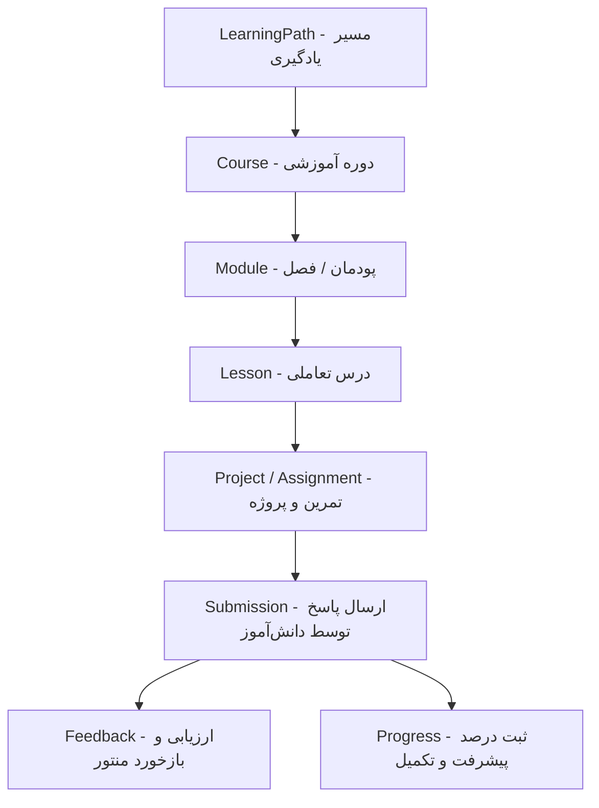

# Phase 2 Product & Domain Model Blueprint (P2-W1)

**Package**: `PHASE2-CORE-PRODUCT-BUILD`  
**Track**: `P2-W1 — PRODUCT & DOMAIN DEFINITION`  
**Status**: APPROVED_FOR_PREPARATION (Authorized by Commander)

---

## ۱. هویت‌ها و پرسوناهای کاربری (Target Personas)

### ۱.۱. کاربر دانش‌آموز / نوجوان (Student Persona)
- **سنین هدف**: ۱۳ تا ۱۹ سال.
- **اهداف**: یادگیری پروژه‌محور و تعاملی برنامه‌نویسی (پایتون، هوش مصنوعی، وب)، حل چالش‌ها، مشاهده آنی خروجی کد و پیشرفت، کسب نشان‌ها و گیمیفیکیشن.
- **نیازمندی‌های رابط کاربری**: طراحی مدرن، تیره و پرانرژی (Cyberpunk / Dark Violet `#5c24e5` + Neon Accents)، بارگذاری سریع، کامپوننت‌های بزرگ و متناسب با موبایل، تعامل ساده، و بازخوردهای تشویقی.

### ۱.۲. کاربر والد / سرپرست (Parent Persona)
- **اهداف**: نظارت بر روند رشد تحصیلی و مهارتی فرزند، مشاهده خلاصه‌های دوره‌ای، تایید دسترسی‌ها و اشتراک‌ها، بدون ایجاد اصطکاک برای نوجوان.
- **محدودیت فاز**: فعلاً صرفاً بر پایه بازیگران سنتتیک (Synthetic Actors) مدل‌سازی می‌شود؛ هرگونه ثبت‌نام کاربر واقعی (Real-user signup) یا مدیریت PII طبق دستور فرمانده مسدود است.

### ۱.۳. مربی / منتور (Mentor Persona)
- **اهداف**: بررسی تمارین، پروژه‌ها و سابمیشن‌های دانش‌آموزان، ثبت بازخورد کیفی (Feedback)، هدایت مسیر یادگیری.

### ۱.۴. راهبر پلتفرم (Admin / Operator Persona)
- **اهداف**: مدیریت محتوای آموزشی (دوره‌ها، درس‌ها، پروژه‌ها)، نظارت بر سلامت سیستم، بررسی فعالیت‌ها و دسترسی‌ها (Audit Log).

---

## ۲. ساختار و سلسله‌مراتب یادگیری (Learning Hierarchy)

### موجودیت‌های هسته یادگیری (Learning Core Entities):
1. **`LearningPath`**: مسیرهای کلان یادگیری (مانند «مسیر فرانت‌اند»، «مسیر بک‌اند»، «مسیر مهندسی هوش مصنوعی»).
2. **`Course`**: دوره‌های مشخص درون مسیر، دارای برچسب سطح (مقدماتی، متوسط، پیشرفته).
3. **`Module`**: فصول آموزشی برای گروه‌بندی سرفصل‌ها.
4. **`Lesson`**: واحدهای یادگیری مستقل شامل توضیحات، قطعه کدها، و ویدیو یا متن تعاملی.
5. **`Project / Assignment`**: پروژه‌های عملی پیاده‌سازی متصل به هر درس یا ماژول.
6. **`Submission`**: نسخه ثبت‌شده پاسخ دانش‌آموز به پروژه.
7. **`Feedback`**: نقد و بررسی ثبت‌شده توسط منتور.
8. **`Progress`**: متغیر حالت پیشرفت دانش‌آموز (شروع‌نشده، در حال انجام، تکمیل‌شده).

---

## ۳. چرخه حیات و ماشین‌های حالت (State Machines)

### ۳.۱. چرخه ارسال و بازخورد تکالیف (Assignment & Submission Lifecycle)
`DRAFT` → `SUBMITTED` → `UNDER_REVIEW` → `FEEDBACK_PROVIDED` → (`COMPLETED` | `REVISION_REQUESTED`)

### ۳.۲. چرخه وضعیت درس و دوره (Lesson Progress Lifecycle)
`LOCKED` → `AVAILABLE` → `IN_PROGRESS` → `COMPLETED`

---

## ۴. مرزهای MVP و Non-Goals فاز ۲
- **در محدوده (In-Scope)**:
  - داشبورد جامع دانش‌آموز (مشاهده دوره‌ها، درس فعال، سابمیشن‌ها و بازخوردها).
  - داشبورد خلاصه‌محور والد (بر پایه داده‌های ساختگی/سنتتیک).
  - کارتابل منتور (صف بازبینی تمرین‌ها).
  - پنل ادمین برای مدیریت محتوای دوره و درس.
- **خارج از محدوده (Strict Non-Goals)**:
  - ثبت‌نام کاربر واقعی با احراز هویت پیامکی/ملی (PII).
  - درگاه پرداخت واقعی و تراکنش‌های مالی شتابی.
  - تعبیه مدل‌های هوش مصنوعی زنده در Runtime فرانت‌اند بدون ADR جدید.
