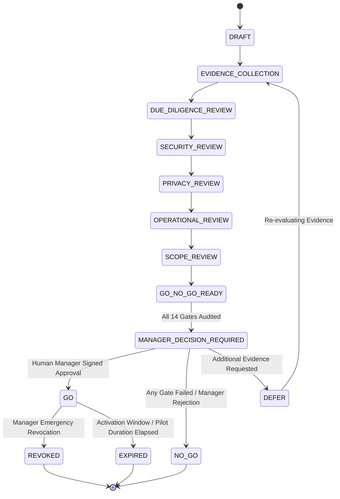

# P7 Manager Go/No-Go Decision Matrix
## Phase 7 Real Pilot Manager Decision & Admission Preparation

This document defines the 14 mandatory binary Go/No-Go gates that govern the Human Manager's decision. 
**Rule**: No weighted scoring or compensatory averaging is permitted. Every non-waivable gate MUST evaluate to `PASS`. A single failure results in automatic `NO_GO`.

### 1. Non-Waivable Hard Stop Gates (Fail-Closed)

| Gate ID | Domain | Gate Title & Evaluation Criteria | Verification Mechanism | Non-Waivable |
| :--- | :--- | :--- | :--- | :--- |
| **G-01** | Tenant Security | Multi-Tenant Isolation & RLS (`FORCE ROW LEVEL SECURITY`, `NOBYPASSRLS`) | Automated test suite & PostgreSQL schema dump | **YES** |
| **G-02** | Child Safety | Zero Student Ranking, Zero Public Leaderboards, BiDi Isolation | UI audit, DOM inspection, Antigravity test | **YES** |
| **G-03** | Data Privacy | Zero Real PII Admission, Strict Synthetic-Only Ingestion | DLP regex scan, payload schema verification | **YES** |
| **G-04** | Legal Basis | Dual-Custody Verified Parental Consent Framework | Consent engine legal text audit | **YES** |
| **G-05** | Disaster Recovery| Verified PITR Rehearsal & Multi-Tenant Backup/Restore Isolation | PostgreSQL PITR recovery logs | **YES** |
| **G-06** | Data Destruction | Crypto-Shredding Engine & Cryptographic Receipt Generation | Key-destruction audit proofs | **YES** |
| **G-07** | Operational Exit | Fail-Safe Emergency Suspension & Immediate Session Termination | Single-action killswitch test | **YES** |
| **G-08** | Audit Trail | Tamper-Evident Immutable Audit Log (Zero UPDATE/DELETE allowed) | Database trigger / rule verification | **YES** |
| **G-09** | Authority | Human Manager Exclusive Approval (Zero Codex/AI/Admin bypass) | Ed25519 digital signature check | **YES** |
| **G-10** | Separation | Separation of Duties & Self-Approval Denial | Operator vs. Approver identity check | **YES** |
| **G-11** | Open Severity | Zero Unresolved SEV1 / SEV2 Security or Architectural Blockers | Sentry / issue tracker zero-blocker state | **YES** |
| **G-12** | Fleet Consensus | Unanimous 3/3 Independent Fleet Review Pass (Qwen, GLM, Gemini) | Signed fleet audit disposition packages | **YES** |
| **G-13** | Contract Drift | Zero OpenAPI Contract Drift (`OPENAPI_SCHEMA_DRIFT: 0`) | Automated `test_openapi_contract.py` pass | **YES** |
| **G-14** | Production Lock | Zero Real Infrastructure Egress (SMS, Email, Payment Sandbox Only) | Egress network proxy rule verification | **YES** |

---

### 2. Decision States & Semantics

- **`GO`**: Human Manager grants authorization for bounded activation within the defined `SCOPE_HASH` and `ACTIVATION_WINDOW`.
- **`NO_GO`**: Manager rejects candidate or any hard-stop gate failed. Termination is immediate and fail-closed.
- **`DEFER`**: Manager pauses decision; candidate remains in holding state pending fresh evidence. Re-evaluation required.
- **`REVOKED`**: Manager revokes active token prior to expiration; immediate cessation of pilot runtime.
- **`EXPIRED`**: Token or pilot duration exceeds time boundary; automatic return to locked baseline.
