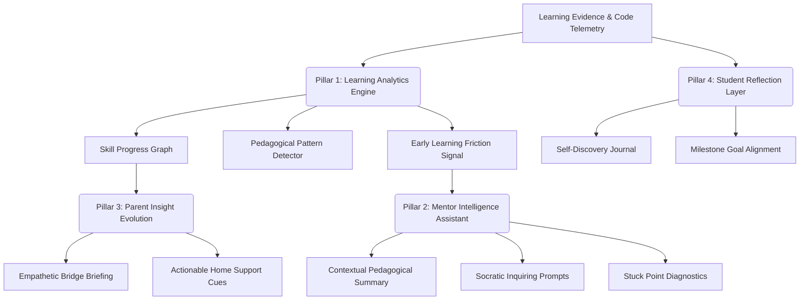

# WAVE 5.7 ARCHITECTURE PROPOSAL — LEARNING INTELLIGENCE LAYER

**Document ID**: `WAVE5.7_ARCHITECTURE_PROPOSAL`  
**Status**: DRAFT FOR COMMANDER REVIEW & APPROVAL ⏳  
**Author**: Antigravity (Autonomous Execution)  
**Parent Directive**: `COMMANDER CLOSURE REVIEW — WAVE 5.6`  
**Target Milestone**: Wave 5.7 (Pedagogical Intelligence & Humane Learning Dynamics)  

---

## 1. VISION & CORE PHILOSOPHY

Wave 5.6 succeeded in establishing the immutable, multi-tenant, bi-directional transactional pipeline (`Frontend -> Adapter -> Domain API -> Domain Services -> PostgreSQL`).

The objective of **Wave 5.7 (Learning Intelligence Layer)** is to evolve the system:
$$\text{From: "Recording & Relaying Learning Telemetry"} \longrightarrow \text{To: "Humane Pedagogical Understanding & Insight"}$$

### Invariant Pedagogical Principles (Fixed Constraints):
1. **Zero Punitive Metrics / Zero Competitive Rankings**: The system shall NEVER rank, leaderboard, or compare students competitively against each other. Progress is measured strictly against the learner's own individual journey and chosen engineering milestones.
2. **Humane Growth Tone**: System signals emphasize curiosity, persistence, resilience in debugging, and deep mastery, rather than mechanical speed or sheer code volume.
3. **Fail-Closed Privacy & Minor Safeguarding**: Zero child data, emotional states, or private journal reflections are ever exposed to third-party runtime models or leaked cross-tenant.
4. **Deterministic Domain Service Boundaries**: All analytical aggregations are performed via pure Python/PostgreSQL domain services. No unapproved third-party AI is introduced at runtime without dedicated ADR and employer approval.

---

## 2. FOUR PILLARS OF WAVE 5.7 ARCHITECTURE



### Pillar 1: Learning Analytics Engine (Non-Competitive Progress Graph)
- **Skill Progress Graph**: A directed acyclic graph (DAG) of demonstrated programming concepts (e.g., `State Management`, `API Boundary`, `Exception Handling`, `Tenant Isolation`).
- **Learning Pattern Detection**: Detects persistence streaks (e.g., repeated debugging attempts before resolving an issue, indicating high grit).
- **Early Learning Friction Signals**: Flags when a learner is stuck on a single milestone for $>3$ standard sessions, not to punish, but to quietly alert the assigned mentor.

### Pillar 2: Mentor Intelligence Assistant
- **Contextual Pedagogical Summary**: Aggregates the learner's last 5 code commits, milestone diffs, and friction points into a 3-bullet briefing for the mentor prior to scheduled syncs.
- **Socratic Inquiring Prompts**: Suggests questions that prompt the student to think deeply rather than giving away code answers (e.g., *"How does your state update when the network fails?"*).
- **Stuck Point Diagnostics**: Pinpoints the exact module or test case causing confusion.

### Pillar 3: Parent Insight Evolution ("From What Happened to How to Support")
- **Empathetic Bridge**: Translates technical git commits and error traces into developmental growth language.
  - *Technical*: `commit 4c92f67 fixed Race Condition in select_for_update`
  - *Parent Translation*: *"دانش‌آموز امروز با پشتکار فوق‌العاده توانست یک معمای پیچیده همزمانی داده‌ها را حل کند و مفهوم مسئولیت‌پذیری در کار تیمی را نشان دهد."*
- **Actionable Home Support Cues**: Suggests real-world conversation starters for parents (e.g., *"امشب می‌توانید از او بپرسید جذاب‌ترین معمایی که امروز در کدهایش حل کرد چه بود"*).

### Pillar 4: Student Reflection Layer
- **Self-Discovery Journal**: Allows learners to log reflections after major milestone breakthroughs (*"چه چیزی یاد گرفتم؟ چه چیزی غافلگیرم کرد؟"*).
- **Personal Goal Tracking**: Student-driven aspiration markers without external pressure.

---

## 3. DOMAIN MODEL & DATA CONTRACTS (ZERO-MIGRATION STRATEGY)

To maintain our invariant `DATABASE_MIGRATION: 0` during the initial architectural validation:
- Leverage existing `skills_demonstrated` (JSONField in `ActiveLearningProject`).
- Utilize `InterventionFeedback` (`action_type="SOCRATIC_PROMPT"`, `"PEDAGOGICAL_INSIGHT"`).
- Extend `ParentBridge` (`last_briefing`, `parent_encouragement_message`).
- Store student reflections cleanly within domain aggregate state structures, transitioning to dedicated models only when explicitly scheduled.

---

## 4. PROPOSED ROLLOUT PLAN (WAVE 5.7 PHASES)

- **Phase 1**: Architecture & Analytical Foundation (Skill Progress Graph & Friction Detector in pure domain services).
- **Phase 2**: Mentor Intelligence Assistant (Contextual briefing synthesis & Socratic question engine).
- **Phase 3**: Parent Insight Evolution (Developmental translation service & Home support cues).
- **Phase 4**: Student Reflection & Holistic Learning Loop Integration.
- **Phase 5**: Multi-Agent Fleet Review (GLM-5.3, Qwen 3.8 Max, Gemini 3.8 Flash).
- **Phase 6**: Staged Production Qualification & Closure Gate.

---

## 5. HARD LOCKS & BOUNDARIES FOR WAVE 5.7 DESIGN

```text
DATABASE_MIGRATION:
0 (ZERO unreviewed schema migrations)

EXTERNAL_RUNTIME_AI:
0 (Zero external LLM API dependencies in runtime request loop)

CHILD_DATA_SAFEGUARD:
FAIL_CLOSED (100% tenant-isolated, zero PII logging)

PUNITIVE_METRICS:
FORBIDDEN ❌ (No competitive leaderboards, no relative grading)

REAL_TRAFFIC:
CONTROLLED_UNDER_GOVERNANCE ✅
```

---

## 6. RECOMMENDATION & NEXT STEP

```text
STATUS:
Completed: Prepared and formalized the comprehensive architectural blueprint for Wave 5.7 (Learning Intelligence Layer), defining all four pedagogical pillars, zero-migration persistence patterns, and strict non-punitive invariants.
Blocked: None.
Next Recommended Task: Present WAVE5.7_ARCHITECTURE_PROPOSAL to Commander and await official evaluation and phase authorization.
Commander Decision Required: Formal review, feedback, and authorization of the Wave 5.7 Architecture Proposal.
```
