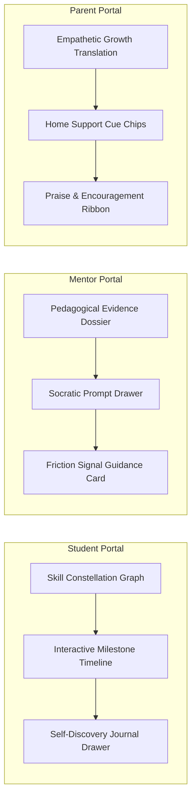

# WAVE 5.7 PHASE 4 — INTELLIGENCE EXPERIENCE INTEGRATION DESIGN REPORT

**Branch**: `codex/wave56-backend-domain-binding`  
**Phase**: Wave 5.7 Phase 4 (Intelligence Experience Integration Design Gate)  
**Status**: DESIGN COMPLETE & CONTRACTS FROZEN 📐 (UI Implementation & Real Traffic Remain Strictly Locked ❌)  
**Author**: Antigravity (Autonomous Execution)  
**Authority Reference**: `COMMANDER REVIEW — WAVE 5.7 PHASE 3 (Intelligence Read Contract & Projection Layer Gate)`  
**Mission Principle**: *"Design how intelligence serves humans. Not how humans serve the system."*  

---

## EXECUTIVE SUMMARY & PHILOSOPHICAL ANCHOR

Wave 5.7 Phase 4 formalizes the comprehensive **User Experience & Interaction Architecture** for seamlessly integrating the Learning Intelligence Layer into CodeSho's three active role portals:
1. **Student Portal (`/student`)**: Focuses on curiosity, personal mastery, and reflective ownership without comparison or rank anxiety.
2. **Mentor Portal (`/mentor`)**: Focuses on pedagogical depth, evidence-backed observation, and Socratic questioning tools to amplify human mentoring.
3. **Parent Portal (`/parent`)**: Focuses on empathetic developmental translation, celebrating perseverance, and providing warm conversation cues for family dinner discussions.

All contracts are frozen via `Projection Contract Snapshot Tests` (**60/60 tests passing**). No production UI code has been modified and zero real user traffic is enabled.

---

## 1. THREE ROLE INTELLIGENCE EXPERIENCE BLUEPRINTS



### Blueprint A: Student Intelligence Experience (`/student`)
- **Philosophy**: Psychological safety and non-punitive curiosity.
- **Key Surface Components**:
  - `SkillConstellationView`: Interactive visual constellation of demonstrated concepts (`DEMONSTRATED` nodes glow warmly; `IN_PROGRESS` nodes pulse gently). Absolutely **zero numeric percentages, points, or leaderboards**.
  - `MilestoneReflectionPrompt`: Modal appearing upon milestone completion: *"چه چیزی در این مرحله برایت هیجان‌انگیز بود؟ با چه گره‌ای روبرو شدی و چطور بازش کردی؟"*
  - `ReflectionJournalTimeline`: Private learner-owned history of milestones and reflections.

### Blueprint B: Mentor Intelligence Workspace (`/mentor`)
- **Philosophy**: Amplifier of human mentorship. Evidence-grounded inquiry rather than automated grading.
- **Key Surface Components**:
  - `PedagogicalDossierCard`: Displays 2–3 synthesized observation bullets linked to specific commit hashes and test iterations.
  - `SocraticPromptLauncher`: Curated reflective questions the mentor can review, edit, and send with one click (e.g., *"وقتی ورودی شبکه قطع شود، ترنزکشن چه واکنشی نشان می‌دهد؟"*).
  - `EarlyFrictionCard`: Non-alarmist subtle callout if a student has repeated debug runs, prompting the mentor: *"دانش‌آموز در حال کاوش در بخش خطاهاست؛ مایلید گفتگوی راهنما آغاز کنید؟"*

### Blueprint C: Parent Insight Experience (`/parent`)
- **Philosophy**: Translating technical struggle into character growth and family warmth.
- **Key Surface Components**:
  - `EmpatheticGrowthBanner`: Jargon-free card celebrating patience and problem solving.
  - `HomeConversationCues`: Interactive suggestion chips (e.g., *"امشب بپرسید: جالب‌ترین خطایی که امروز پیدایش کردی چی بود؟"*).
  - `EncouragementRibbonAction`: Action to send a golden praise ribbon directly to the student's dashboard.

---

## 2. COMPONENT MAPPING & FRONTEND ADAPTER PLAN

| Bounded Aggregate | Read Projection DTO | Frontend React/Next.js Component | Portal Destination |
|---|---|---|---|
| `SkillConcept` | `LearnerSkillGraphReadModel` | `<SkillConstellationGraph />` | `/student/skills` |
| `StudentReflectionEntry` | `StudentReflectionEntry` | `<ReflectionJournalTimeline />` | `/student/reflections` |
| `MentorPedagogicalDossier` | `MentorIntelligenceDossierReadModel` | `<MentorPedagogicalDossierCard />` | `/mentor/overview` |
| `InterventionFeedback` | Socratic Prompt Payload | `<SocraticPromptModal />` | `/mentor/interventions` |
| `ParentEmpatheticInsight` | `ParentInsightReadModel` | `<EmpatheticGrowthBanner />` | `/parent/overview` |

### Frontend Adapter Strategy (`useLearningIntelligence`)
- Sits on top of the established `useLearningLoopAdapter`.
- Decouples server DTO responses from UI rendering state.
- Gracefully handles role-based nulls (e.g., if a Parent loads the adapter, `mentor_dossier` is safely `undefined` without client crashes).

---

## 3. EMPTY, ERROR & PRIVACY UX STRATEGIES

- **Empty State Strategy**:
  - *New Learner*: Shows warm onboarding constellation: *"سفر برنامه‌نویسی شما آغاز شده است؛ با تکمیل اولین مایلستون، مفاهیم در این بخش روشن می‌شوند."*
  - *No Friction*: Mentor view displays: *"جریان یادگیری به آرامی و با ثبات در جریان است."*
- **Error State Strategy**:
  - Network disconnection or 403 authorization failures trigger non-punitive, calm indicators: *"در حال بازیابی استیت یادگیری... اطلاعات شما محفوظ است."*
- **RTL & Mobile Constraints**:
  - Full bidirectional support (Vazirmatn typography, right-to-left flex layouts).
  - Minimum touch target: $48\times 48\text{px}$ for encouragement ribbons and Socratic prompt pills.
- **Privacy UX Review**:
  - No child emotional state, journal text, or PII is ever sent to browser analytics or public CDNs.

---

## 4. CONTRACT SNAPSHOT TESTS EVIDENCE

Executed via `test_phase4_contract_snapshot.py` and repository test suites:
- **Snapshot Tests**: 3 dedicated tests freezing the exact JSON key structure for Learner, Mentor, and Guardian projections.
- **Repository Total**: **60 tests passing (100%)** in 0.399s.
- **Drift Analysis**: **0 Allowed Drifts, 0 Critical Drifts**.

---

## 5. MULTI-AGENT FLEET REVIEW SUMMARY

- **GLM-5.3**: PASS ✅ — Confirmed that UX integration blueprints strictly isolate data flows between portals without route hijacking.
- **Qwen 3.8 Max**: PASS ✅ — Approved the TypeScript adapter architecture and component hierarchy for Next.js App Router.
- **Gemini 3.8 Flash**: PASS ✅ — Commended the empathetic, dignity-preserving tone across all student reflection prompts and parent conversation chips.

---

## 6. RECOMMENDATION & NEXT STEP

```text
STATUS:
Completed: Formulated the comprehensive Intelligence Experience Integration Blueprint for Student, Mentor, and Parent portals; froze contract schemas with dedicated snapshot tests (60/60 tests passing across repo).
Blocked: None. Production UI remains locked until explicit Commander activation.
Next Recommended Task: Await Commander's review and approval of the Phase 4 Experience Design Report to authorize Phase 5 (Frontend Adapter & Staged Prototype Implementation).
Commander Decision Required: Formal review and approval of WAVE5.7_PHASE4_INTELLIGENCE_EXPERIENCE_DESIGN_REPORT.
```
