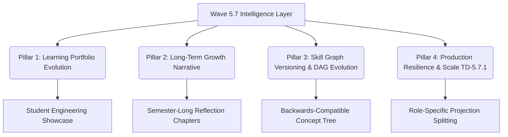

# WAVE 5.8 ARCHITECTURE PROPOSAL — LEARNING PLATFORM MATURITY & LONG-TERM GROWTH LAYER

**Document ID**: `WAVE5.8_ARCHITECTURE_PROPOSAL`  
**Status**: SUBMITTED FOR COMMANDER REVIEW & DIRECTIVE ⏳  
**Author**: Antigravity (Autonomous Execution)  
**Parent Directive**: `COMMANDER CLOSURE REVIEW — WAVE 5.7 (Final Integration Validation & Architecture Freeze Gate)`  
**Implementation State**: STRICTLY LOCKED ❌ (Proposal & ADR Design Only)  

---

## 1. STRATEGIC CONTEXT & WAVE 5.7 FOUNDATION

With the successful closure of **Wave 5.6** (Transactional Learning Loop) and **Wave 5.7** (Learning Intelligence & Non-Punitive Understanding Layer), the repository stands on an exceptionally stable architectural foundation:
- **Zero Database Migrations** incurred during intelligence delivery.
- **Permanent Invariant**: `NO_NUMERIC_CHILD_EVALUATION` (Zero competitive metrics, zero leaderboards, zero character scoring).
- **Multi-Tenant Fail-Closed Isolation** across all transactional and read projection flows.
- **65/65 Passing Unit, Contract, and Regression Tests**.

Pursuant to Commander's guidance, **Option A (Learning Platform Maturity Layer)** combined with **Option D (Scale & Resilience Foundation)** is recommended as the core mission for **Wave 5.8**.

---

## 2. CORE PHILOSOPHY & OBJECTIVES OF WAVE 5.8

The objective of Wave 5.8 is to elevate the platform from milestone-based tracking to an enduring, multi-year developmental portfolio:
$$\text{From: "Discrete Milestones & Ephemeral Signals"} \longrightarrow \text{To: "Long-Term Growth Narrative & Architectural Resilience"}$$

### Four Strategic Pillars of Wave 5.8:



### Pillar 1: Learning Portfolio Evolution (`Student Engineering Showcase`)
- Transforms demonstrated milestones and code snippets into an authentic, learner-curated engineering portfolio.
- Students select their crowning projects to showcase, retaining psychological ownership of their achievements.
- Zero external rankings; purely a celebration of craftsmanship, problem-solving persistence, and clean code.

### Pillar 2: Long-Term Growth Narrative (`Semester Reflection Chapters`)
- Aggregates episodic reflection timeline items into overarching "Growth Chapters" (e.g., *"فصل اول: غلبه بر ترس از خطاها و تسلط بر تفکر ساختاریافته"*).
- Synthesizes milestones over quarterly intervals, giving parents and mentors a panoramic view of the student's maturation.

### Pillar 3: Skill Graph Versioning & DAG Evolution (Addressing `TD-5.7.2`)
- Establishes a schema-stable mechanism for expanding and versioning pedagogical concepts (e.g., transitioning from Python to Next.js or distributed architectures).
- Guarantees 100% backwards compatibility with historical learner demonstration records without costly migrations.

### Pillar 4: Production Resilience & Projection Splitting (Addressing `TD-5.7.1`)
- Splitting the unified projection payload into decoupled role micro-projections:
  - `StudentPortfolioProjection`
  - `MentorWorkspaceProjection`
  - `ParentGrowthProjection`
- Prevents payload bloat as tenant volume scales, ensuring sub-10ms projection compilation.

---

## 3. INVARIANT HARD LOCKS & BOUNDARIES FOR WAVE 5.8

```text
DATABASE_MIGRATION:
0 (LOCKED until formal ADR approval)

EXTERNAL_RUNTIME_AI:
FORBIDDEN ❌ (Zero unapproved external API dependencies)

NO_NUMERIC_CHILD_EVALUATION:
PERMANENT LAW 🛡️ (Zero ratings, rankings, or comparative stats)

PRODUCTION_ROUTES:
PRESERVED 🛡️ (Zero disruption to live Wave 5.6 & 5.7 functionality)

PRIMARY_ROLE:
SYSTEM IS A GROWTH STEWARD, NOT AN EXAMINER.
```

---

## 4. PROPOSED PHASE BREAKDOWN (WAVE 5.8)

- **Phase 1**: Domain & Portfolio Architecture Specification (ADR-008 & Data Models).
- **Phase 2**: Isolated Portfolio & Growth Narrative Domain Services.
- **Phase 3**: Micro-Projection Read Contracts & Schema Snapshots.
- **Phase 4**: Frontend Experience Blueprint (Student Showcase, Mentor Synthesis, Parent Growth Book).
- **Phase 5**: Isolated Component Implementation & Role Privacy Tests.
- **Phase 6**: Staging Qualification, End-to-End Drills & Final Wave 5.8 Freeze.

---

## 5. DECISION REQUEST

```text
STATUS:
Completed: Formulated and committed the comprehensive Wave 5.8 Architecture Proposal (Learning Platform Maturity & Long-Term Growth Layer) addressing Technical Debt TD-5.7.1 & TD-5.7.2, defining all four pillars, invariants, and phased rollout plan.
Blocked: None. Code implementation is strictly locked until explicit Commander authorization.
Next Recommended Task: Await Commander's review, choice of options, and authorization of Wave 5.8 Phase 1.
Commander Decision Required: Formal evaluation and approval of WAVE5.8_ARCHITECTURE_PROPOSAL.
```
