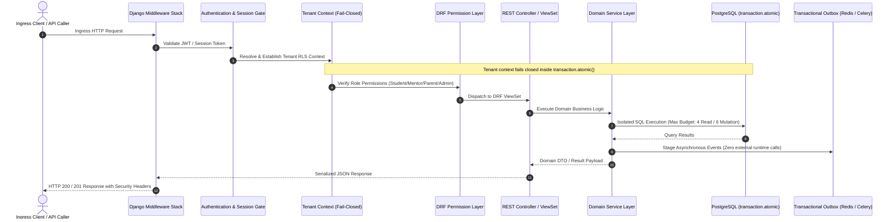

# Backend Runtime Execution Map

## 1. Request / Response Lifecycle & Execution Flow

---

## 2. Execution Layers & Responsibilities

### 2.1 Middleware Execution Chain
1. `SecurityMiddleware`: HSTS, Content-Type sniffing protection, X-Frame options.
2. `TenantContextMiddleware`: Establishes tenant isolation context before domain execution. Fails closed (`HTTP 403 / 404`) if tenant identity is unverified.
3. `SessionMiddleware` & `AuthenticationMiddleware`: Populates `request.user` without exposing credential tokens in logs.
4. `CsrfViewMiddleware`: Enforces CSRF tokens on state-mutating requests (`POST`, `PUT`, `DELETE`).

### 2.2 Domain Service Layer & Database Boundary
- **Transaction Safety**: Business mutations execute strictly within `transaction.atomic()`.
- **Query Budgeting**: Read queries capped at 4 statements; N+1 queries eliminated via `select_related` and `prefetch_related`.
- **Outbox Pattern**: Telemetry, notifications, and cross-domain events are persisted transactionally to the outbox buffer. Zero external HTTP calls inside SQL transactions.

### 2.3 Exception Handling & Fail-Closed Behavior
- All unhandled exceptions trigger `custom_exception_handler` returning structured, sanitized RFC 7807 error envelopes without stack traces or server internals.
