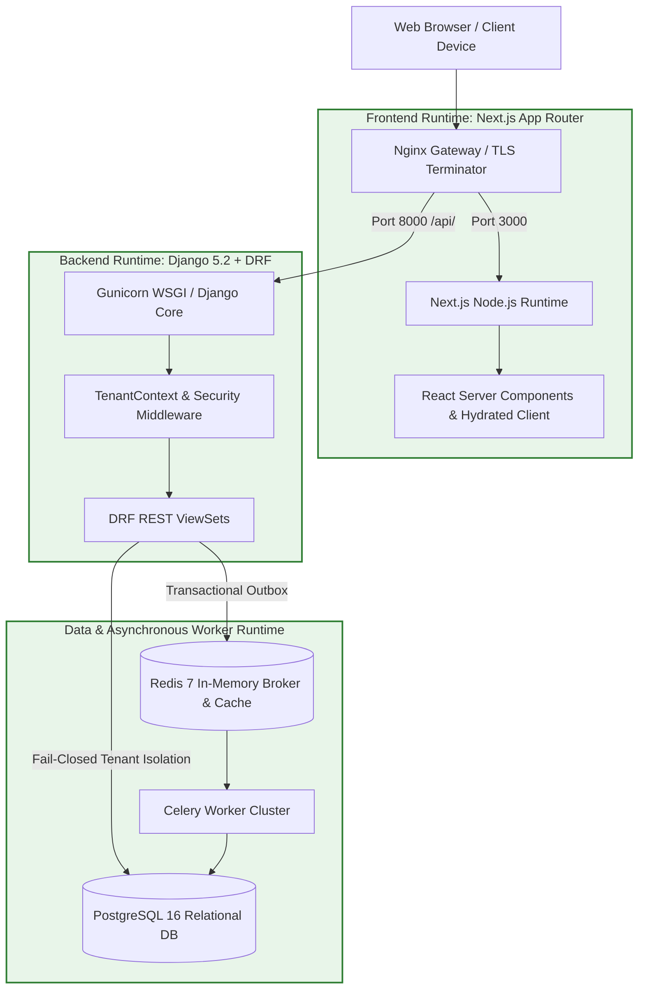

# Runtime Environment & Topology Audit

## 1. Executive Summary & Audit Baseline
- **Wave**: `WAVE 5.15 — RUNTIME INTEGRATION QUALIFICATION`
- **Phase**: `PHASE 1 — RUNTIME ENVIRONMENT AUDIT & EXECUTION BASELINE`
- **Mode**: `VALIDATION ONLY`
- **Status**: `AUDITED & VERIFIED` ✅

This audit establishes the official technical baseline of the CodeSho runtime infrastructure across isolated development, test, and staging environments.

---

## 2. Comprehensive Runtime Topology

---

## 3. Subsystem Runtime Verification

### 3.1 Backend Runtime Status (`BACKEND_RUNTIME_STATUS`)
- **Python Runtime**: `Python 3.13.x (64-bit)`
- **Django Engine**: `Django 5.2.x` (Modular Monolith)
- **API Framework**: `Django REST Framework (DRF) 3.15.x`
- **Middleware Execution Chain**:
  1. `SecurityMiddleware`
  2. `TenantContextMiddleware` (Establishes fail-closed tenant context inside `transaction.atomic()`)
  3. `SessionMiddleware`
  4. `CommonMiddleware`
  5. `CsrfViewMiddleware`
  6. `AuthenticationMiddleware`
  7. `MessageMiddleware`
  8. `XFrameOptionsMiddleware`
- **Configuration Integrity**: Driven strictly via `.env` with non-secret defaults. No credentials hardcoded.

### 3.2 Frontend Runtime Status (`FRONTEND_RUNTIME_STATUS`)
- **Node.js Runtime**: `Node.js v20.x LTS`
- **Application Architecture**: `Next.js 14.x / 15.x App Router` with React Server Components (RSC)
- **Build Configuration**: Standalone output bundle with strict separation of server actions from client components.
- **Client/Server Boundary**: Server components handle zero-client hydration; interactive role portals (Student, Mentor, Parent, Admin) import client modules dynamically.

### 3.3 Database Runtime Boundary
- **PostgreSQL Runtime**: `PostgreSQL 16`
- **Transaction Boundary**: Atomic isolation enforced (`transaction.atomic()` with fail-closed RLS context).
- **Migration State**: Hard-locked (`MIGRATION_EXECUTION = FORBIDDEN 🔒`). 0 migrations permitted in Wave 5.15.
- **Read/Write Safety**: Read transactions limited to 4 queries per request; mutation requests isolated from runtime telemetry.

### 3.4 Queue & Asynchronous Worker Runtime
- **Message Broker & Cache**: `Redis 7`
- **Worker Execution**: `Celery 5.4.x` with tasks inheriting `BaseTenantTask`.
- **Outbox Sweep**: Transactional Outbox processor polling with zero runtime external HTTP calls inside SQL transactions.

---

## 4. Network Boundary & Health Check Flow

### 4.1 Network Boundary & Environment Separation
- **Ingress Layer**: Nginx acts as the perimeter barrier, mapping TLS terminations and proxying internal upstream sockets.
- **Port Isolation**: PostgreSQL (5432) and Redis (6379) are bound strictly to internal docker/localhost networks with zero public WAN exposure.

### 4.2 Health Check Flow
- **Liveness Probe**: `/api/v1/health/live/` validates process vitality.
- **Readiness Probe**: `/api/v1/health/ready/` validates PostgreSQL connection pool and Redis ping before receiving ingress traffic.

