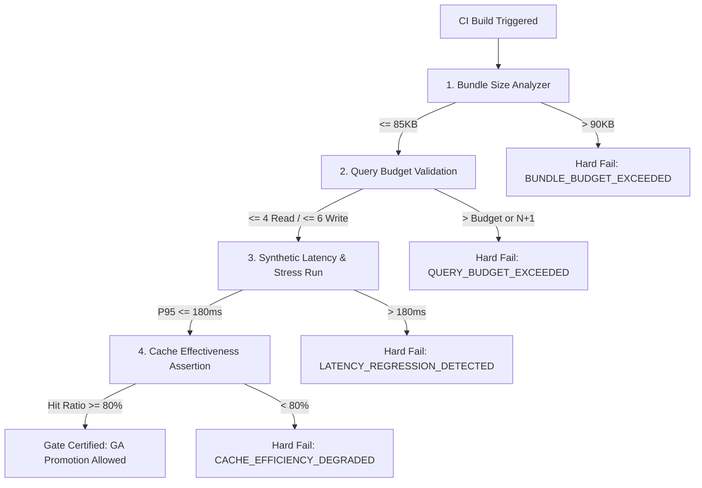

# Performance Regression Gate Specification

## 1. Objectives & CI Governance
The Performance Regression Gate blocks any deployment or branch promotion that violates latency baselines, query budgets, cache effectiveness, or bundle size constraints.

---

## 2. Hard Enforcement Thresholds

| Governance Dimension | Baseline Target | Regression Threshold (Hard Failure) | Verification Method |
|---|---|---|---|
| **API P95 Latency** | `<= 120ms` | `> 180ms` (Any regression > 25%) | Automated Synthetic Load Runner |
| **Database Query Count (Read)** | `<= 4 queries` | `> 4 queries` (N+1 strictly forbidden) | Django `assertNumQueries` Test Gate |
| **Database Query Count (Mutation)**| `<= 6 queries` | `> 6 queries` | Django `assertNumQueries` Test Gate |
| **Cache Hit Ratio (L1)** | `>= 90%` | `< 80%` | Redis Mocking / Hit Rate Validator |
| **Client Shared Bundle Size** | `<= 85 KB (gzip)` | `> 90 KB (gzip)` | `@next/bundle-analyzer` CI Artifact Gate |
| **Hydration Cost (4x CPU Throttling)**| `<= 200ms` | `> 350ms` | Headless Lighthouse CI Gate |
| **Cumulative Layout Shift (CLS)** | `<= 0.01` | `> 0.05` | Persian Typography Layout Shift Gate |

---

## 3. Regression Gate Circuit Breaker Flow

