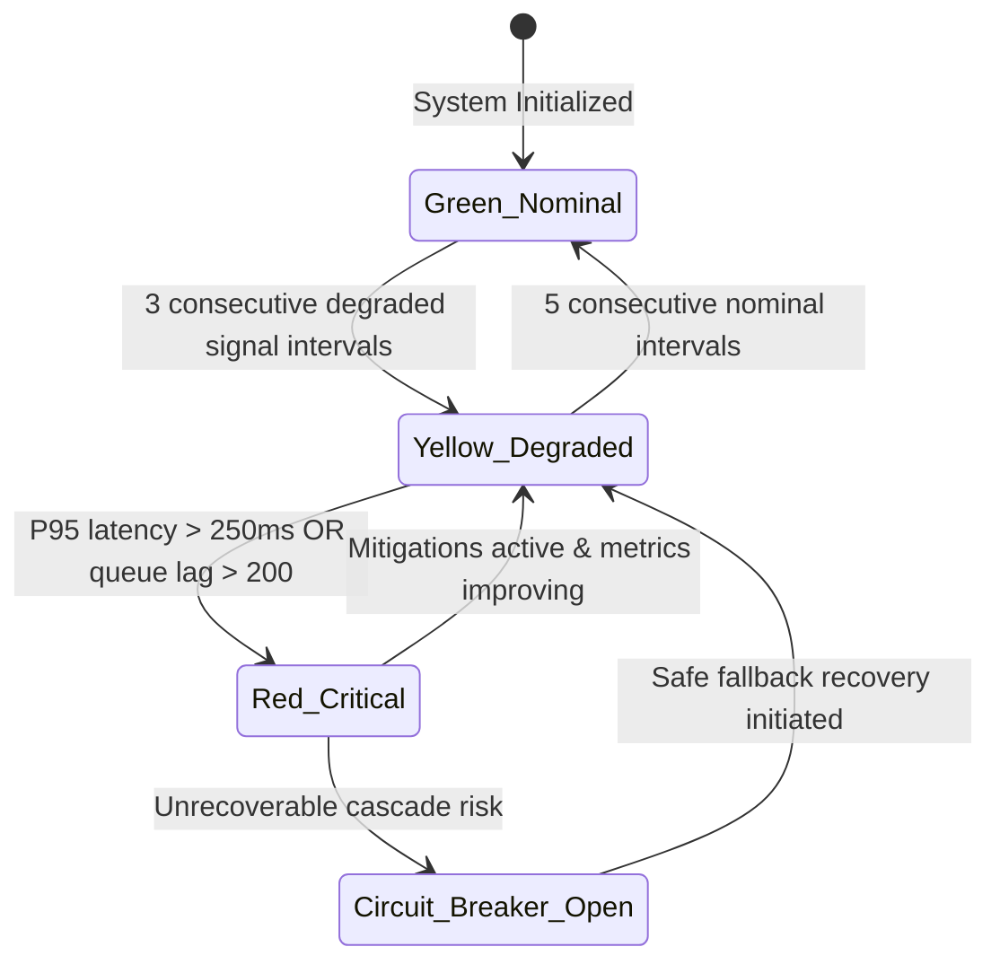

# Reliability Signal Model & Threshold Matrix

## 1. Purpose & Signal Taxonomy
The Reliability Signal Model classifies system health into operational degradation stages without attributing technical slowdowns to user behavior or learning pace.

---

## 2. Signal Taxonomy & Operational Thresholds

| Signal Category | Measurement Metric | Green (Nominal) | Yellow (Degraded) | Red (Critical Alarm) | Mitigation Action |
|---|---|---|---|---|---|
| **API Latency** | REST API P95 Duration | `< 120ms` | `120ms - 250ms` | `> 250ms` | Trigger cache pre-warming, scale Gunicorn workers |
| **Database Health** | P95 Query Execution Time | `< 15ms` | `15ms - 45ms` | `> 45ms` | Terminate idle connections, flag unindexed query plans |
| **Database Queries**| Query Count per Read | `<= 4 queries` | `5 - 7 queries` | `> 7 queries` | Enforce query budgeting, flag N+1 regression |
| **Cache Health** | Redis L1 Hit Ratio | `> 90%` | `75% - 90%` | `< 75%` | Evict stale keys, adjust memory ceiling |
| **Queue Depth** | Celery Backlogged Tasks | `< 50 tasks` | `50 - 200 tasks` | `> 200 tasks` | Auto-scale Celery worker pods |
| **Worker Heartbeat**| Sweep / Heartbeat Lag | `< 10s` | `10s - 30s` | `> 30s` | Restart unhealthy worker instances |
| **Outbox Sweep** | Stagnant Outbox Records | `< 5 records` | `5 - 25 records` | `> 25 records` | Trigger immediate outbox processor sweep |

---

## 3. Signal Aggregation & Alert Dispatch State Machine

