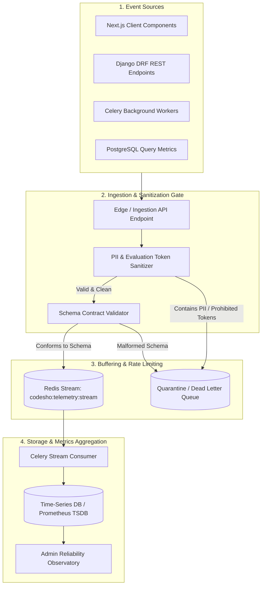

# Telemetry Pipeline Architecture Specification

## 1. Architectural Invariant & Zero-PII Guarantees
The CodeSho Telemetry Pipeline is engineered with a strict **fail-closed, zero-PII, zero-evaluation architecture**. It exists exclusively to track platform infrastructure reliability, query performance, and front-end rendering budgets without collecting personal identifying data or generating student evaluations.

---

## 2. Pipeline Components & Operational Contracts

### 2.1 Ingestion Collector
- **Endpoint**: `/api/v1/telemetry/events/` (HTTP POST).
- **Authentication**: Tenant-scoped ephemeral JWT or anonymous HMAC token.
- **Rate Limit**: 100 events per client session per 5-minute sliding window. Exceeded budgets are dropped silently (HTTP 204) to prevent DOS.

### 2.2 PII & Evaluation Token Sanitizer
Every event payload undergoes synchronous regex and dictionary filtering before entering the buffer:
1. **Masking Identifiers**: National IDs (10 digits), phone numbers (`09...`), email addresses, and student UUIDs are matched and purged.
2. **Evaluation Token Rejection**: Any key or payload containing prohibited semantic stems (`score`, `grade`, `rank`, `percentile`, `speed_rank`, `eval_label`) causes immediate dropping of the event to the quarantine sink.

### 2.3 Validation & Quarantine Sink
- Payloads must strictly parse against `TELEMETRY_EVENT_SCHEMA.md`.
- Failed payloads are logged to an ephemeral in-memory quarantine sink with stripped details for security monitoring.

### 2.4 Redis Stream Buffering
- Stream Key: `codesho:telemetry:stream`.
- Maximum length: `MAXLEN ~ 50000` entries to bound memory usage.
- Multi-worker consumer group ensures exactly-once aggregation processing.
