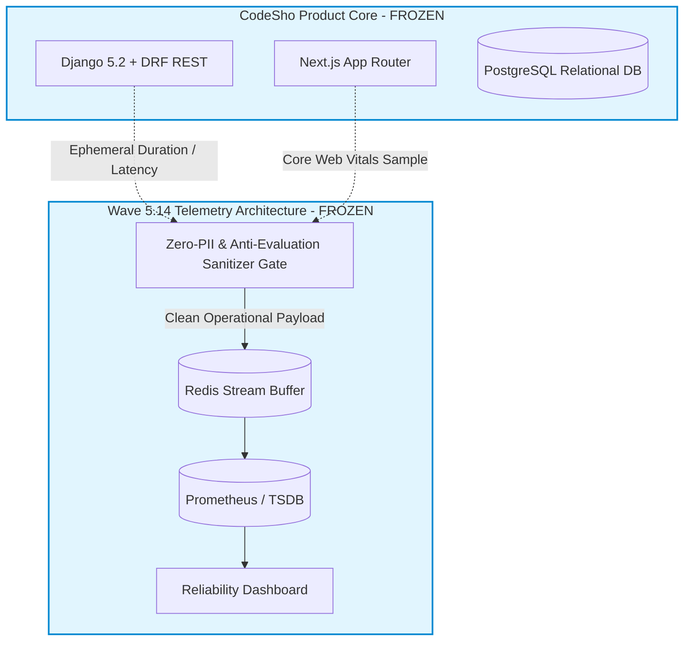

# WAVE 5.14 Architecture Certification & Governance Freeze

## 1. Executive Statement & Scope of Certification
This document certifies that the **Platform Telemetry & Performance Optimization Architecture** (Wave 5.14) has been fully specified, formally reviewed, and hardened against regression under the authority of Commander AI and Human Management.

---

## 2. Certified Architectural Domains & Standards

### 2.1 Performance Architecture Domain
- **Frontend Core Web Vitals Budget**:
  - First Contentful Paint (FCP): `<= 800ms` (Max: `1200ms`)
  - Largest Contentful Paint (LCP): `<= 1500ms` (Max: `2200ms`)
  - Cumulative Layout Shift (CLS): `<= 0.01` (Max: `0.05`)
  - Client Component Hydration Ceiling: `<= 180ms` (Max: `350ms`)
  - Shared JS Bundle Ceiling: `<= 85 KB (gzip)`
- **Backend Latency & Query SLA**:
  - REST API P95 Latency: `<= 120ms`
  - Maximum Read Query Budget: `<= 4 queries` (Zero N+1 tolerance)
  - Maximum Mutation Query Budget: `<= 6 queries`
  - Cache Hit Floor: `>= 90%` target, `>= 80%` regression barrier

### 2.2 Telemetry & Security Boundary Domain
- **Zero-PII Guarantee**: Strict fail-closed scrubbing of national codes, Iranian mobile patterns, and email formats.
- **Anti-Evaluation Invariant**: Absolute prohibition against collecting, computing, or displaying scores, competitive rankings, or learning speed classifications.
- **Data Isolation**: Telemetry data streams exclusively into Redis ephemeral buffers and TSDB collectors; direct relational writes to product PostgreSQL databases are prohibited.
- **Multi-Tenant HMAC Hashing**: Tenant identities are salted and transformed into 64-character SHA-256 hashes (`pattern: ^[a-f0-9]{64}$`).

---

## 3. Dependency & Architectural Invariant Map

