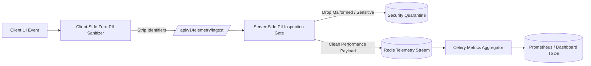

# Zero-PII System Telemetry & Governance Contract

## 1. Ethical Governance & Zero-Evaluation Contract

### 1.1 Invariant Statement
System telemetry within CodeSho exists exclusively to guarantee platform stability, responsiveness, operational safety, and resource availability. It must never measure, infer, quantify, or benchmark student capabilities or human learning pace.

### 1.2 Allowed vs. Prohibited Data Matrix

| Category | Allowed Telemetry Fields (Operational) | Strictly Prohibited Fields (Evaluation / PII) |
|---|---|---|
| **Identity** | Anonymous tenant hash, Ephemeral trace UUID, Session category | Student real names, Phone numbers, National IDs, Personal emails |
| **Learning Activity** | Route render time, Component load success, DOM event cycle duration | Scores, Percentiles, Skill rank comparisons, Completion time comparisons |
| **System Health** | Query durations, Cache hit ratio, Redis memory usage, Worker lag | Behavioral scoring labels, "Slow learner" tags, Engagement rankings |
| **Errors & Traces**| HTTP status codes, Unhandled UI exceptions, Network timeout logs | Child private notes, Form draft entries, Direct messaging payloads |

---

## 2. Ingestion Pipeline & Scrubbing Protocol



### 2.1 Scrubbing Rules
1. **Header Scrubbing**: `Authorization`, `Cookie`, `X-CSRFToken` headers are stripped prior to latency calculation persistence.
2. **URL Parameter Normalization**: All entity IDs in path or query strings (e.g. `/portfolio/uuid-1234/`) are canonicalized to generic tokens (`/portfolio/:id/`).
3. **Payload Sanitization**: Request bodies containing user input are completely omitted from telemetry logs; only body size in bytes (`content_length`) is tracked.

---

## 3. Telemetry Ingestion Contract Definition

```typescript
export interface SystemTelemetryPayload {
  readonly version: "1.0.0";
  readonly timestamp_utc: string; // ISO8601
  readonly trace_id: string; // UUIDv4
  readonly tenant_hash: string; // SHA-256 of tenant salt
  readonly context: {
    readonly platform_role: "STUDENT" | "MENTOR" | "PARENT" | "ADMIN";
    readonly route_canonical: string;
    readonly viewport: "MOBILE" | "TABLET" | "DESKTOP";
  };
  readonly metrics: {
    readonly fcp_ms?: number;
    readonly lcp_ms?: number;
    readonly hydration_cost_ms?: number;
    readonly api_roundtrip_ms?: number;
    readonly error_code?: string;
  };
}
```
